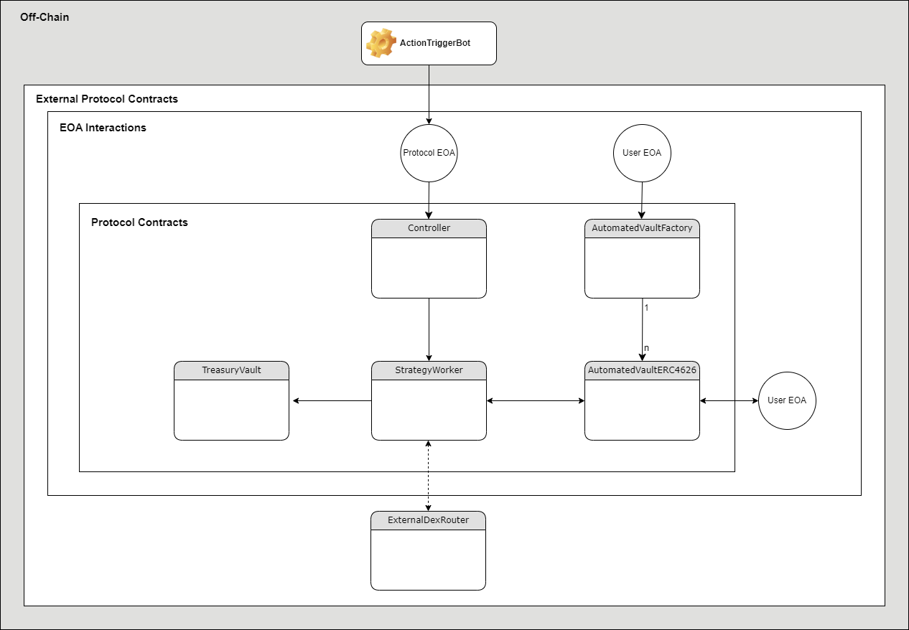

# ERC-4626 Tokenized Automated Strategy Vaults

## Architecture Diagram

### Arbitrum Mainnet Contract Addresses

- **TreasuryVault:** 0xC6a3eB9DB61D314f3c2D4f5F55323cF5057dbF75
- **Controller:** 0x1e4cdDadE599e963E09AF9CFE0cea218D392b1A3
- **StrategyWorker:** 0xB2CeE323903Fc416290b2D4eF35Bd9E88efd5df4
- **AutomatedVaultsFactory:** 0xb09Ca5ed3161DF852855a000689886338A559Ed5
